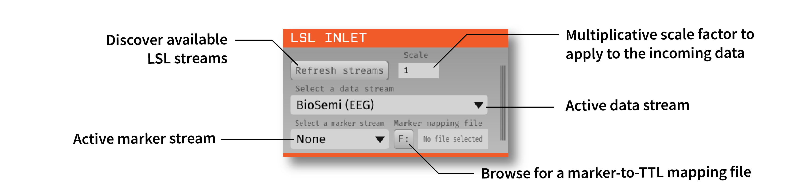

# LSL inlet plugin 
A simple plugin to recieve from one LSL EEG and one LSL Markers stream on the network. This plugin is a modified version of [the official open ephys LSL plugin](https://github.com/open-ephys-plugins/lab-streaming-layer-io), downgraded to Open Ephys V5. 

## Usage

Works with or without a JSON mapping file. If there is no JSON file present, only event channels 1-8 will be accepted. See [the sample JSON mapping file](./Resources/event-map.json).

### Known bugs
Sending events to any channels aside from 1 or 2 may cause strange behavior. Use event channels 3-8 with caution.

### Windows
This is currently built for windows only. I believe you can download the latest lsl libraries for your system, put them in the libs folder and update the CMakeLists accordingly. 

### Building the plugins
Building the plugins requires [CMake](https://cmake.org/). Detailed instructions on how to build open ephys plugins with CMake can be found in [the Open Ephys GUI documentation](https://open-ephys.github.io/gui-docs/Developer-Guide/Compiling-plugins.html).

## Attribution
Developed by Joel Nielsen (@JoelNielsen7).
